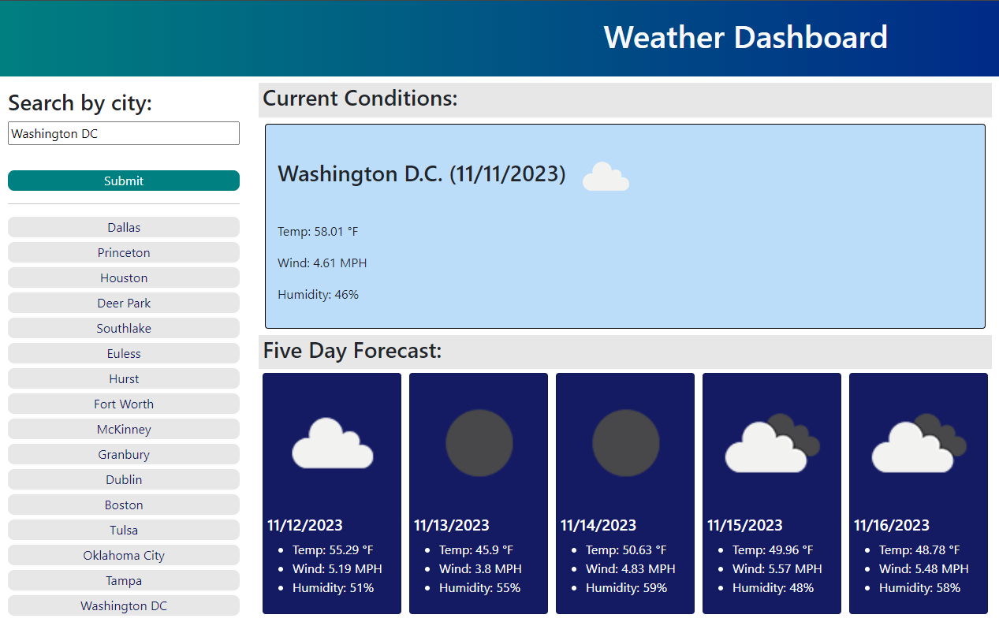

# weather-dashboard

## Description

This is a weather application that will allow the user to check the current and future weather for several locations. This project was created with HTML, CSS and jQuery.

## Usage

To use, search for a city name and click the submit button. The current weather in that location will be displayed, as well as a 5 day future forecast. Previous searches will also be easily accessible as buttons under the search form.

Here is the live website. [Try it out!](https://shanna-not-shawna.github.io/weather-dashboard/)

## Credits

Dominique Meeks Gombe provided tutoring and guidance on this project.

## How to Contribute

If you would like to contribute to this project, please reach out to the author.